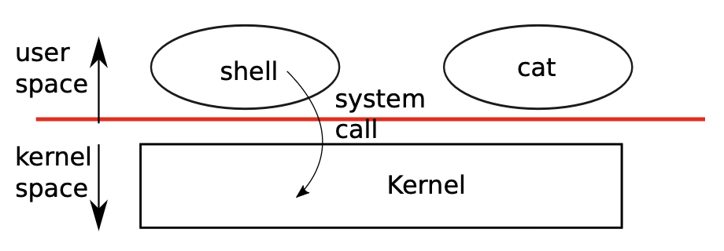

# Chapter 1

**OS**: share hardware resources with multiple programs; control program interaction; abstract underlying hardware; provide interface through which applications request services
{height="50%" width="50%" style="display: block; margin: 0 auto" }

**OS workflow**: user issues a system call to request a service from kernel, kernel performs service and returns
**Shell**: ordinary program in userspace; read commands and execute them; basically a big while loop
```
cmd <- empty buf
while (there's incoming command) do
    remove leading whitespaces from cmd
    remove trailing newline characters
    if (cmd is empty) then
        move to next command
    else if (cmd is a cd command) do
        call chdir
    else
        fork and run cmd in child
        wait for child to complete
    end
done     
```
**Process**: ID + userspace memory (instructions, data, function stack) + per-process state private to kernel; time-shared by OS
**`fork()`**: create exact copy of calling process; parent/child execute with separate memory + registers after `fork()`
**`exit()`**: stop calling process; release resources (e.g., memory, open files)
**`wait()`**: wait for calling process's children to finish; wait until at least one finishes and return its pid; immediately return -1 if no children
**`exec()`**: load new memory image of a file in file system into existing process's address space; won't return to calling program
**Process copying is expensive, modern OS usually uses copy-on-write in `fork()`'s implementation**

**File descriptor**: a small integer representing a kernel-managed object that a process may read from or write to; each process has a private space of fds; 0 for `stdin`, 1 for `stdout`, 2 for `stderr`; each one has an internal offset
**The newly allocated fd is always the lowest numbered unused fd of the current process**
**I/O redirection**: made possible by `fork()` + fds
```
// cat < input.txt
char* args[2] = {"cat", 0};
if (fork() == 0) {
    close(0);
    open("input.txt", O_RDONLY);
    exec("/bin/cat", args);
    exit(1);
} else {
    wait(0);
}
```
**`fork()` copies the underlying fds, and the offsets are also shared across processes**
```
// $ hello world
if (fork() == 0) {
    write(1, "hello ", 6);
    exit(0);
} else {
   wait(0);
   write(1, "world\n", 6); 
}
```
**`dup()`**: duplicate an existing fd and return a new one that refers to the same underlying I/O object (both fds share the same offset)
```
fd = dup(1);
write(1, "hello ", 6);
write(fd, "world\n", 6);
```
**Pipe**: a small kernel buffer exposed to processes as a pair of fds (one for reading, one for writing); used for inter-process communication
```
// run wc with stdin connected to read end of a pipe
int p[2];
char* args[2] = {"wc", 0};
pipe(p);
if (fork() == 0) {
    close(0);
    dup(p[0]);  // 0 refers to p's read end
    close(p[0]);
    close(p[1]);
    exec("/bin/wc", args);
    exit(1);
} else {
    close(p[0]);
    write(p[1], "hello world\n", 12);
    close(p[1]);
}
```
**Pipe vs. file: pipes automatically clean themselves up; pipes can pass arbitrarily long stream of data, files require suffient amount of disk to store all data first; pipes allow parallel execution of pipeline stages**